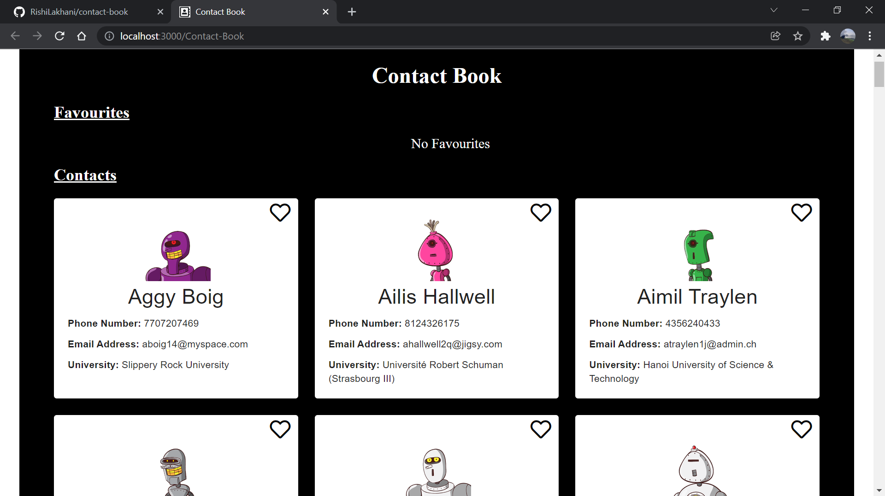
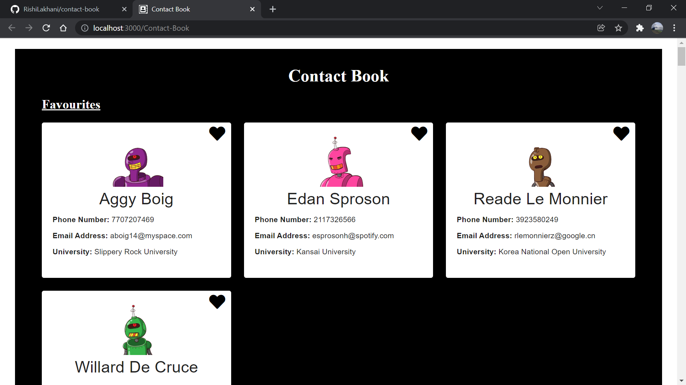

# A Contact Book

This is a simple contact book which uses React JS, Material UI and a Axios to read all the data and displays it on the screen.

The application is composed of the following Features:

* The application reads data consisting of avatar, name, phone no., email id and university from the API using Axios.
* Now the application sorts the contacts on the basis of the name and displays it.
* The application also allows you to mark a contact as your favourite. The favourites are displayed at the top of the page.

**SCREENSHOTS:**

Landing Page:


---
Page on adding Favs:


---

## Developed With

* [Visual Studio Code](https://code.visualstudio.com/) - A source code editor developed by Microsoft for Windows, Linux and macOS. It includes support for debugging, embedded Git control, syntax highlighting, intelligent code completion, snippets, and code refactoring
* [React](https://reactjs.org/) - A javascript library for building user interfaces
* [Create react app](https://create-react-app.dev/) - A quick method to start developing a react application.
* [Material UI](https://v4.mui.com/) - React components for faster and easier web development.
* [Axios](https://axios-http.com/) - HTTP Client for node.js and the  browser.

---


## Getting Started

These instructions will get you a copy of the project up and running on your local machine for development and testing purposes.

### Prerequisites

The following software is required to be installed on your system:

* Node 8.x
* Npm 3.x

Type the following commands in the terminal to verify your node and npm versions

```bash
node -v
npm -v
```

### Install

Follow the following steps to get development environment running.

* Clone _'react-e-commerce-website.git'_ repository from GitHub

  ```bash
  git clone https://github.com/RishiLakhani/contact-book
  ```

* Install node modules

   ```bash
   npm install
   ```


### Starting front-end servers

* Build application

  ```bash
  npm start
  ```
---


